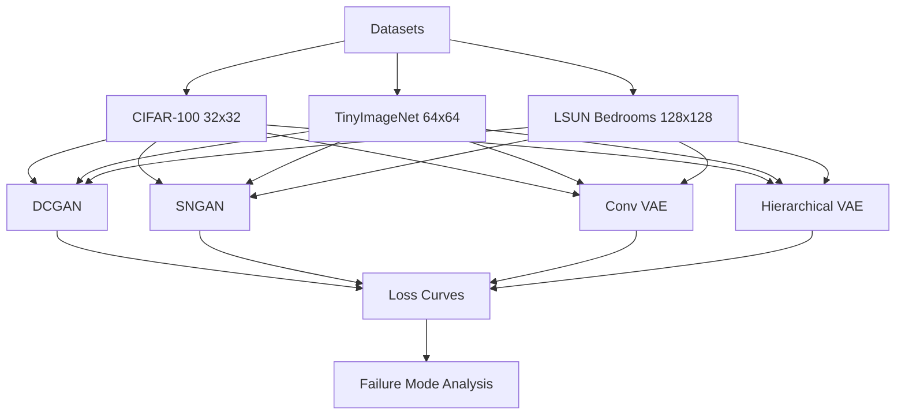

# 🔬 **GenFail AI – Failure Mode Analysis of Generative Models**

<div align="center">


**Understanding Why Generative Models Fail — Across Architectures, Scales, and Data Regimes**

[📖 Paper Draft](#) • [📊 Results](#results) • [🚀 Getting Started](#getting-started)

</div>

---

## 🌟 **Core Research Idea**

### 🚨 **The Problem with Generative Models**
```
❌ Models are evaluated only on final outputs:
→ FID scores, visual samples

❌ Failure behaviors are ignored:
→ Mode collapse, blurry outputs, instability

❌ No cross-dataset understanding:
→ Same model behaves differently across datasets
```

---

### ✅ **Our Research Contribution**
```
✅ Systematic Failure Mode Analysis:
→ Compare GANs vs VAEs across datasets of increasing complexity

✅ Multi-Dataset Benchmarking:
→ CIFAR-100 (32x32), TinyImageNet (64x64), LSUN Bedrooms (128x128)

✅ Architecture-Level Insights:
→ DCGAN vs SNGAN vs ConvVAE vs Hierarchical VAE

✅ Failure Explanation Framework:
→ Link failures to dataset scale, diversity, and model inductive bias
```

---

## 🎯 **What Makes This Work Unique?**

| Aspect | Existing Work | GenFail AI |
|--------|--------------|-----------|
| Evaluation | Final metrics (FID, IS) | 🔬 **Failure behavior analysis** |
| Models | Single architecture | 🧠 **GANs vs VAEs comparison** |
| Datasets | Single dataset | 🌍 **Multi-scale dataset study** |
| Insight | Performance-focused | 📉 **Failure-focused reasoning** |
| Explainability | Limited | ✅ **Loss curve + behavior analysis** |

---

## 🏗️ **Experimental Architecture**



### 🧠 **Models Under Study**

1. **🔴 Generative Adversarial Networks (GANs)**  
   - **DCGAN**: Classic convolutional GAN, known for instability and mode collapse  
   - **SNGAN (Spectral Normalization GAN)**: Stabilized discriminator via spectral normalization with improved training dynamics  

2. **🔵 Variational Autoencoders (VAEs)**  
   - **Convolutional VAE**: Pixel-space reconstruction, tends to produce blurry outputs  
   - **Hierarchical VAE**: Multi-level latent representations with better expressiveness but harder optimization  

---

## 📊 **Datasets & Complexity Scaling**

| Dataset           | Resolution | Size  | Complexity |
|------------------|------------|-------|------------|
| **CIFAR-100**     | 32×32      | 60K   | Low        |
| **TinyImageNet**  | 64×64      | 110K  | Medium     |
| **LSUN Bedrooms** | 128×128    | 300K  | High       |

---

## 🔍 **Key Failure Modes Studied**

### ⚠️ **GAN Failures**
- Mode collapse  
- Training instability (oscillating losses)  
- Vanishing gradients  
- Sensitivity to dataset complexity  

### ⚠️ **VAE Failures**
- Blurry reconstructions  
- Posterior collapse  
- Underfitting high-resolution data  
- Latent space inefficiency  

---

## 📈 **Analysis Methodology**

### 📊 **1. Loss Curve Analysis**
- Generator vs Discriminator loss trends  
- KL divergence vs reconstruction loss (VAEs)  
- Stability patterns across datasets  

### 🖼️ **2. Sample Quality Evaluation**
- Visual inspection across epochs  
- Diversity vs fidelity trade-off  

### 🔍 **3. Cross-Dataset Comparison**
- Performance degradation with increasing resolution  
- Scaling behavior analysis  

### 🧠 **4. Failure Attribution**
- Linking failures to:  
  - Dataset size  
  - Image resolution  
  - Model inductive bias  
  - Optimization constraints  
Optimization constraints

---

## 📊 **Key Insights (Expected / Observed)**

### 🔴 **GAN Observations**
- **DCGAN** struggles on **LSUN (128×128)** → severe instability  
- **SNGAN** improves stability but still:  
  - Suffers from mode dropping on complex datasets  

### 🔵 **VAE Observations**
- **Conv VAE**:  
  - Works well on CIFAR-100  
  - Produces blurry outputs on LSUN  

- **Hierarchical VAE**:  
  - Better detail retention  
  - Training becomes unstable at scale  

---

## 🧪 **Experimental Results**

### 📉 **Loss Curve Patterns**
- GANs → oscillatory behavior  
- VAEs → smooth but biased optimization  

### 🎯 **Key Finding**
> **Model failure is not absolute — it is dataset-dependent.**

---

## 🚀 **Getting Started**

### 📋 **Prerequisites**
- Python 3.9+  
- PyTorch  
- CUDA (recommended)  

### ⚡ **Installation**
```bash
# Clone the repository
git clone https://github.com/your-org/genfail-ai.git
cd genfail-ai

# Install dependencies
pip install -r requirements.txt
```

---

### ▶️ **Run Experiments**
```bash
# Train DCGAN on CIFAR-100
python train.py --model dcgan --dataset cifar100

# Train SNGAN on TinyImageNet
python train.py --model sngan --dataset tinyimagenet

# Train VAE on LSUN
python train.py --model vae --dataset lsun
```

---

## 📂 **Project Structure**

```
├── models/
│ ├── gan/
│ ├── vae/
├── datasets/
├── experiments/
├── results/
│ ├── loss_curves/
│ ├── generated_samples/
├── analysis/
└── train.py
```

---

## 🎯 **Research Impact**

### 🔬 **Why This Matters**
- Moves beyond “which model is better”  
- Focuses on “why models fail”  

### 📊 **Applications**
- Model selection for real-world generative tasks  
- Dataset-aware architecture design  
- Improving generative model robustness  

---

## 🚀 **Future Work**
- [ ] Diffusion model comparison  
- [ ] Quantitative metrics (FID, IS)  
- [ ] Failure prediction models  
- [ ] Hybrid GAN-VAE architectures  

---

<div align="center">

**🔬 Understanding Failure is the First Step to Better AI**

</div>

